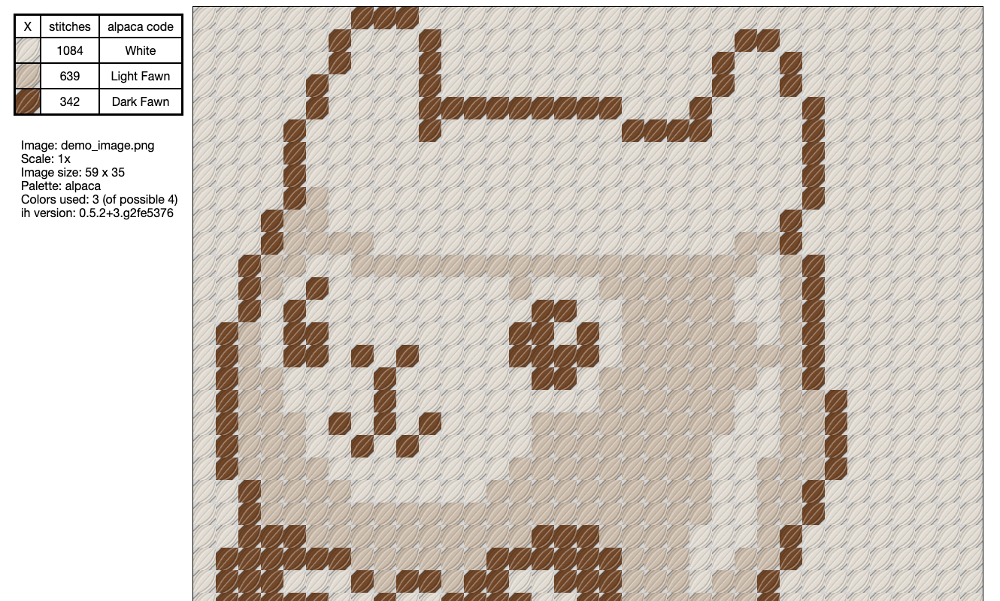

*A very persuasive package, for creating embroidery patterns.*

`ih` is a Python command-line tool for generating cross-stitch patterns from source images. 

Would you prefer to use a website instead? Try [`ih` as a Service](https://github.com/glasnt/ih-aas)

[As seen at PyCon US 2019](https://us.pycon.org/2019/schedule/presentation/229/)

## How to cross-stitch

Check out this amazing [Cross Stitch Carpentry](https://sgibson91.github.io/cross-stitch-carpentry/index.html) lesson!

# `ih` technical details  

## Installation

Requires [Python 3.7+](https://www.python.org/downloads/) and [`pip`](https://pip.pypa.io/en/stable/installing/):

```
pip install ih
```

`ih` is now usable as a CLI. 

## CLI Usage

[//]: <> (START_USAGE)
```
Usage: ih [OPTIONS] IMAGE

Options:
  -p, --palette [lego|floss|floss-dmc|newlego|perler|alpaca|floss-pdx|wool|🧵|🧶|🦙]
                                  Palette to use. See README.md for provenance
                                  [default: wool]

  -s, --scale INTEGER             Rescale factor  [default: 1]
  -c, --colors INTEGER            Limit palette to at most N colors.
                                  [default: 256]

  -r, --render                    Render preview of resulting artwork
                                  [default: False]

  -g, --guidelines, --print-ready
                                  Show guidelines, and print without colour
                                  [default: False]

  -o, --fileformat [html|term]    Output file format  [default: html]
  -f, --outputfolder TEXT         Output folder
  --version                       Show the version and exit.
  --help                          Show this message and exit.

```
[//]: <> (END_USAGE)

Example usage:  

```
ih -p alpaca -r -c 4 demo/demo_image.png -f demo/
```

> For the [demo image](demo/demo_image.png) ([source](https://picsart.com/i/sticker-pixel-pixelart-pixelated-pixels-llama-rainbow-bow-268615356021211), freetoedit) 
> using the alpaca palette, 
> render the result in up to 4 colours,
> to the output folder `demo/`

Open `demo/demo_image.html` to see the result. 




### Printing

Use `--print-ready` for printing. `ih` will: 
 
 * Use print-css functionality to ensure the print view is black+white
 * Use js to dynamically split wide charts. *Requires* jQuery via CDN. 

When printing, the page order will be legend, then a series of columns of chart.
 
## Install from source

Using [`git`](https://git-scm.com/book/en/v2/Getting-Started-Installing-Git) and [`virtualenv`](https://virtualenv.pypa.io/en/latest/installation/):

```
git clone git@github.com:glasnt/ih
cd ih
virtualenv venv
source venv/bin/activate
pip install -r requirements.txt
```

## `ih` as a module

See its use in [`ih-aas`](https://github.com/glasnt/ih-aas/blob/master/app.py)

## Package name origin

Disney's [_Lilo and Stitch_](https://www.youtube.com/watch?v=ItYmxezZ7QA): 

> Jumba: What?! After all you put me through you expect me to help you just like that?! Just like that?!<br>
> Stitch: Ih.<br>
> Jumba: Fine.<br>
> Pleakley: Fine? You're doing what he says?<br>
> Jumba: Uh, he's very persuasive.

## Data provenance


**floss** 

Sourced from http://www.damaniel.info/dmc/dmctorgb.html and http://threadcolors.com/

**floss-dmc**

Sourced from the medium colour on swatch previews from DMC.com

*Oct 2020: This is the palette dervived during the PyCon 2019 talk, but was replaced with a better palette. It still remains available through floss-dmc*

**floss-pdx**

Yet another floss-to-hex palette offered by http://pdxstitch.net/tools/tools.html
and converted to ih format. The original spreadsheet can be found
[here](https://docs.google.com/spreadsheets/u/1/d/14PuY3CbQZcYOYtuMn7446TUBh4h4M5wlI0yx1GWG1XY/preview?usp=sharing#gid=0).

Note that they also provide a couple of other handy tools including a floss use
calculator!

**wool**

Sourced from the medium colour on swatch previews from DMC.com

**lego**

Source from Kaggle dataset colors.csv ([source](https://www.kaggle.com/rtatman/lego-database))

**perler**

Based on Perler Manufacturer information ([source one](https://www.reddit.com/r/beadsprites/comments/291495/bead_list_with_rgb_values/), [source two](https://docs.google.com/spreadsheets/d/1f988o68HDvk335xXllJD16vxLBuRcmm3vg6U9lVaYpA/edit#gid=0))

**alpaca**

Source from Jill Rowling http://speleonics.com.au/jills/shared/alpaca.json


## Attributions

LILO & STITCH is a trademark of Disney Enterprises, Inc.

LEGO® is a registered trademark of The Lego Group. 

PERLER BEADS is a trademark of Stitch Acquisition Group. 

Aurora test image (`test/images/aurora.jpg`) by Jonathan Bean from Unsplash: https://unsplash.com/photos/Ejpx_sdKEKo
